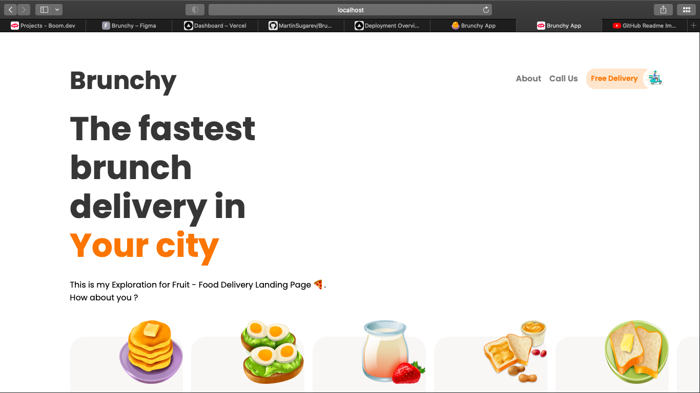
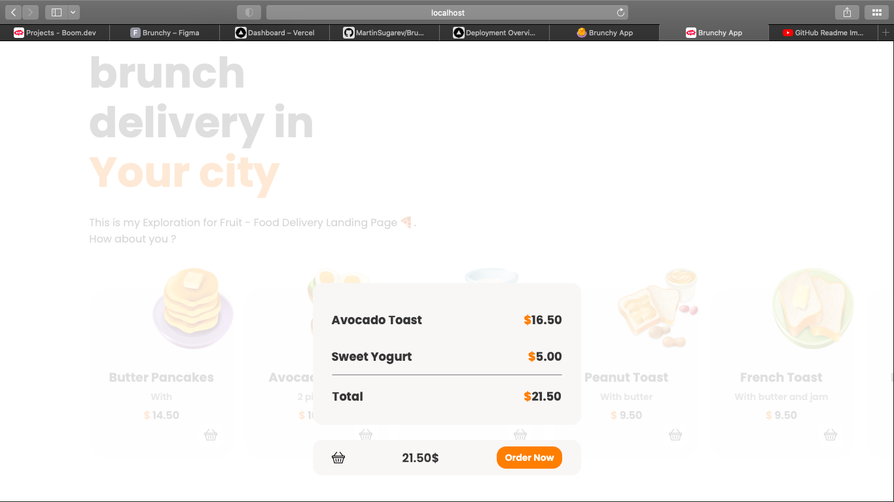
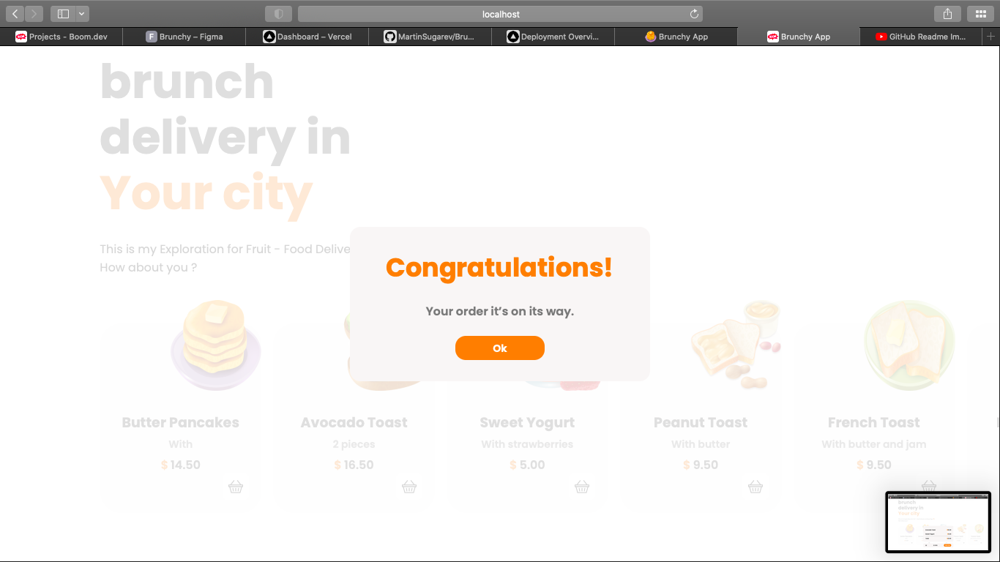

PROJECT NAME:
- Brunchy

DEMO LINK: 
https://brunchy-1djgq5t39-martinsugarev.vercel.app

ABOUT THE APP: 
Brunchy is a simple delivery app which allows user to order their favorite brunch meal. They can add orders to a basket, review the list of meals and then place an order. 

SCREENSHOTS:

TECHNOLOGIES: 
Reactjs, SASS, JavaScript, HTML, classnames

SETUP: 
- clone the repository 
- cd brunchy
- npm install
- npm start

STATUS: 
- ready

